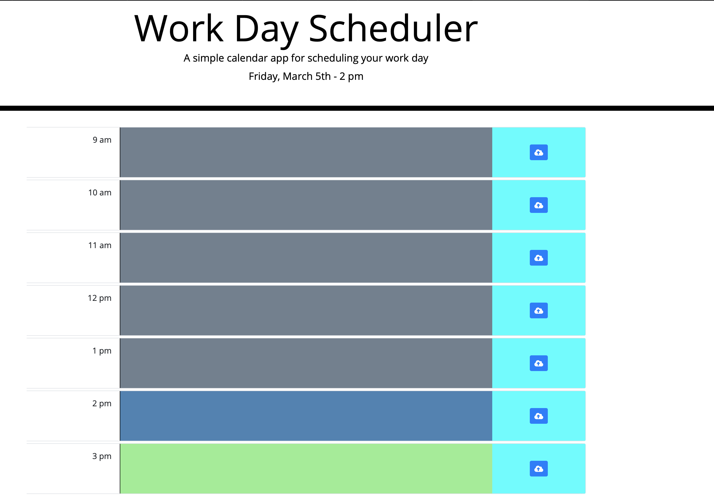

# day-planner

* [Description ](#description)
* [What I Learned](#what-i-learned)
* [Installation and Usage](#installation-and-use)
* [License](#license)

# Description

This is a simple, single-day planning app. Upon loading, the current date and hour is displayed. If the current hour falls within business hours, its corresponding time block will be highlighted in blue in the main section. Time blocks turn grey as they fall into the past, and hours that have not yet passed are highlighted green. 

When the user clicks the text box of any hour, a cursor appears, and a task may be entered. The corresponding "save" button will save the text to localStorage, and it will load upon any refresh/reload until changed. 

This page has been deployed on Github, and can be viewed here:  https://tomekregulski.github.io/day-planner/

# What I Learned

This exercise helped solidify my understanding of working with localStorage, as well as how using loops and template literals can work together to keep code consolidated and efficient. 

This assignment also forced me to work through several considerations when using moment.js to ensure that I achieve the desired functionality. 

# Installation and Use

Clone the repo and open the folder in the code editor of your choice. 

# License

MIT License

Copyright (c) [2021] [Tomek Regulski]

Permission is hereby granted, free of charge, to any person obtaining a copy
of this software and associated documentation files (the "Software"), to deal
in the Software without restriction, including without limitation the rights
to use, copy, modify, merge, publish, distribute, sublicense, and/or sell
copies of the Software, and to permit persons to whom the Software is
furnished to do so, subject to the following conditions:

The above copyright notice and this permission notice shall be included in all
copies or substantial portions of the Software.

THE SOFTWARE IS PROVIDED "AS IS", WITHOUT WARRANTY OF ANY KIND, EXPRESS OR
IMPLIED, INCLUDING BUT NOT LIMITED TO THE WARRANTIES OF MERCHANTABILITY,
FITNESS FOR A PARTICULAR PURPOSE AND NONINFRINGEMENT. IN NO EVENT SHALL THE
AUTHORS OR COPYRIGHT HOLDERS BE LIABLE FOR ANY CLAIM, DAMAGES OR OTHER
LIABILITY, WHETHER IN AN ACTION OF CONTRACT, TORT OR OTHERWISE, ARISING FROM,
OUT OF OR IN CONNECTION WITH THE SOFTWARE OR THE USE OR OTHER DEALINGS IN THE
SOFTWARE.
